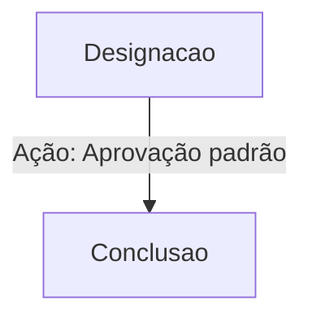

# Playbook: Caso 040: Designacao - Sucesso

## 1. Metadados do Caso
* **ID do Caso:** CASE-040
* **Estado Inicial:** `Designacao`
* **Tipo de Cenário:** `Sucesso`
* **Responsável Principal:** Comercial / Jurídico

## 2. Descrição do Cenário
Transição bem-sucedida de designacao para conclusao sem intercorrências.

## 3. Fluxo Esperado

## 4. Tratativa de Falhas (Estado Delayed)
Caso ocorra uma falha durante a transição para `Conclusao`, o sistema entrará automaticamente no estado **Delayed**.

**Ações de Recuperação:**
1. **Retornar ao estado anterior:** Reverter para `Designacao` e corrigir os dados de entrada.
2. **Avançar manualmente:** Forçar a transição para `Conclusao` após resolução externa.
3. **Acionar Refatoração:** Enviar para revisão com comentário justificativo.

## 5. Sugestão de Evolução (Feedback Loop)
* **Para a Equipe Técnica:** Verificar logs de integração no n8n e garantir que os webhooks estão respondendo em tempo hábil.
* **Para o Cliente/Leigo:** Se o processo travar, verifique se todos os documentos necessários foram enviados corretamente. Nossa equipe será notificada automaticamente para ajudar.

---
*Gerado por Manus AI — Ecossistema API-First & API-AI-First*
